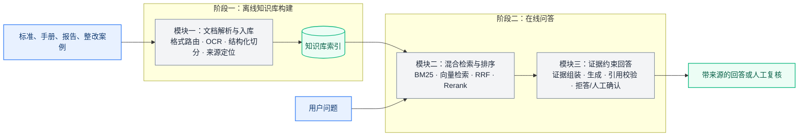
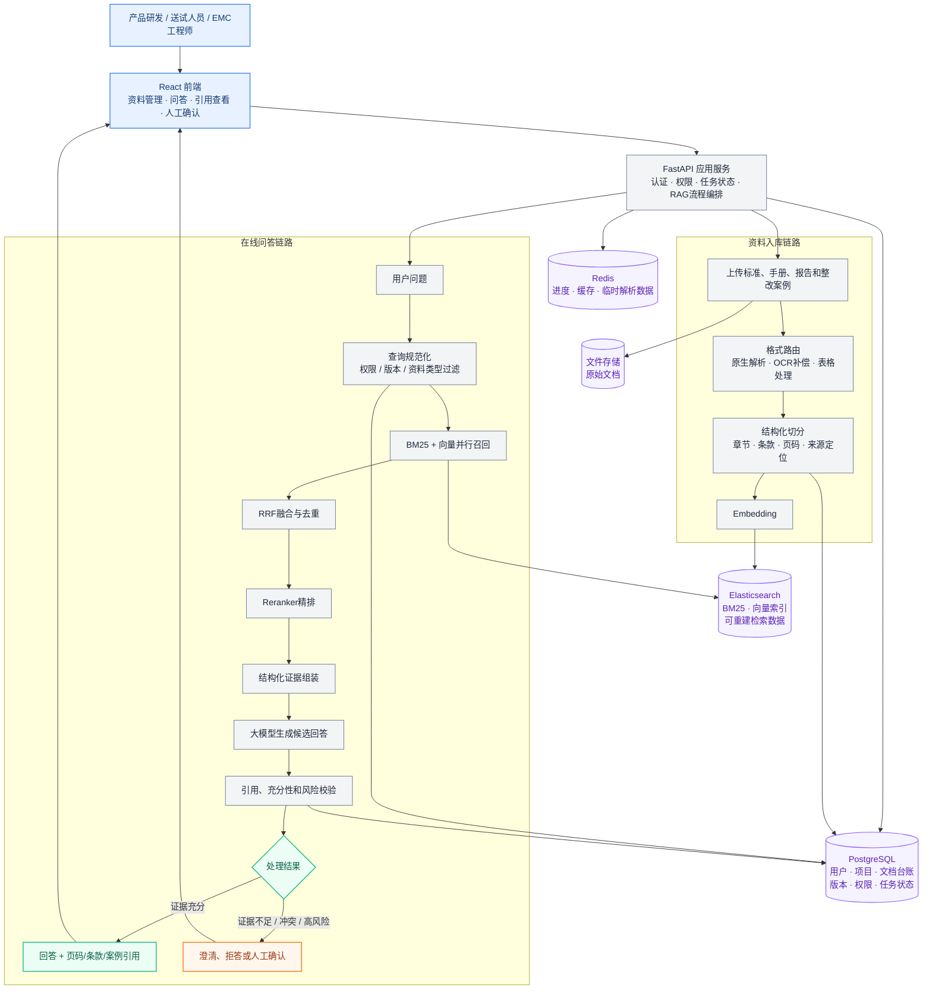

# EMC_RAG · EMC Evidence Assistant

面向电磁兼容（EMC）试验知识的证据优先 RAG 项目，支持复杂文档解析、混合检索、Rerank、证据引用和证据不足拒答。

An evidence-first RAG project for electromagnetic-compatibility (EMC) test knowledge. It supports complex document parsing, hybrid retrieval, reranking, source citation, and evidence-insufficient refusal.

[](https://github.com/aristotlephil8-cell/emc-rag-evidence-assistant/actions/workflows/ci.yml)

[中文](#中文) · [English](#english) · [项目说明](docs/PORTFOLIO.md) · [Architecture](docs/ARCHITECTURE.md) · [Evaluation](docs/EVALUATION.md) · [Badcases](docs/BADCASES.md) · [Security](docs/SECURITY.md)

## 中文

### 项目背景

电磁兼容测试资料分散、格式复杂且持续更新，用户既要查标准编号和设备参数，也要根据测试现象寻找相似案例。普通大模型无法保证知识时效和原文依据，关键词搜索又难以理解语义问题，因此项目采用 RAG，将专业资料独立管理，先检索相关证据，再生成可追溯的回答。

### 项目目标与设计主线

项目目标是帮助工程人员从分散、复杂、持续更新的测试资料中，快速找到适用的标准依据和可参考的整改案例，形成能够回到原文复核的辅助分析结果。

在系统实现上，本项目的 RAG 链路分为离线知识库构建和在线问答两个阶段，包含文档入库、检索排序、证据约束回答三个核心模块：



方案落地后，开发过程中逐渐暴露出四类问题：

1. **资料入库：** 复杂格式、扫描内容和表格信息不能只提取文字，还要通过 parser routing、OCR 和 structure-aware chunking 保留结构与 `SourceLocator`；
2. **检索：** 既要找得到编号、型号等精确信息，也要理解用户对现象和问题的自然语言描述，因此需要结合 BM25、vector retrieval、RRF 和 Reranker；
3. **回答控制：** 找到相关资料后，还要通过 structured claims、`citation_ids` 和 citation validation 避免模型扩大原文含义；
4. **评测：** 每次改动都要通过固定数据集、分层 metrics 和 Badcase regression 判断问题究竟被解决，还是只是换了一种表现。

因此，RAG 主链路由资料入库、检索排序和回答控制三个核心模块组成，评测与 Badcase 回归作为贯穿全流程的验证闭环。

### 关键问题与优化点

| 遇到的问题 | 为什么会出现 | 对应优化 |
|---|---|---|
| 文档内容无法完整进入系统 | 业务资料中既有普通 PDF、Word、表格，也有扫描件和复杂排版；直接提取可能得到空内容或丢失结构 | 按文件类型选择解析路径：文本优先直接提取，复杂资料再使用 OCR 和版面/表格解析；按章节、段落和表格边界切分，并保留页码和来源位置 |
| 同一资料重复进入，旧版本仍被检索 | 资料会被重复上传或更新，基础入库流程难以区分同一个文件和不同版本 | 使用文件哈希识别重复内容，用稳定 `chunk_id`、业务库状态和版本记录支持幂等写入、失败重试和索引重建 |
| 有些问题查不到，或者查到的内容不准确 | 基础向量检索能理解大致意思，但容易漏掉编号、型号和精确数值；只用关键词又难以理解自然语言描述 | 同时使用 BM25 和向量检索，再通过 RRF 融合；根据精确查询与语义查询进行查询路由和权重调整，兼顾两类匹配方式 |
| 相关内容找到了，却没有排在前面 | 多路召回会得到一批相似内容，真正有用的证据可能被排在后面 | 先用较快的检索方式扩大候选范围，再用 Reranker 对较小候选集重新排序；重排失败时显式降级，不隐藏实际执行路径 |
| 模型引用了资料，却没有真正支持结论 | 只在 Prompt 中要求“请引用”仍可能出现引用错误、扩大原文含义或证据不足时继续回答 | 让模型返回结构化 `claims + citation_ids`，由服务端逐条校验；证据不足时拒答，引用或检索异常进入人工复核状态 |
| 优化后无法判断是否真的变好 | 只看几个成功案例，无法区分是解析、召回、排序还是回答环节的问题 | 固定问题集和指标，保留 Badcase，分别验证解析、检索、排序、引用和拒答效果；评测细节见 [Evaluation](docs/EVALUATION.md) 和 [Badcases](docs/BADCASES.md) |

详细数据流、索引生命周期和故障边界见 [架构说明](docs/ARCHITECTURE.md)。

### 项目整体架构

架构设计直接来源于业务需求：资料需要持续更新、版本切换和幂等重试，因此由 PostgreSQL 管理用户、文档、版本和任务等业务事实，Elasticsearch 保存可重建的倒排与向量索引，原始文件独立存储；复杂文档解析不能阻塞在线查询，因此将 ingestion pipeline 与 query pipeline 分开，Redis 负责进度、缓存和临时状态；回答必须能够复核，因此按 retrieval、evidence assembly、generation 和 citation validation 分层，并在高风险场景进入 human-in-the-loop。

核心原则是：**让知识可更新、检索可重建、回答可追溯，高风险结论可由工程师接管。**



### 快速启动

前置条件：Docker Desktop / Docker Engine、Docker Compose v2。首次启动会下载并校验固定版本的 DeepDOC 模型资产；模型体积不计入 Git 仓库。

默认使用 fake Provider：

```powershell
.\scripts\start.ps1 -Provider fake
```

打开：

- 前端：<http://localhost:5173>
- 后端与 OpenAPI：<http://localhost:8000/docs>
- 健康检查：<http://localhost:8000/health>

fake Provider 的向量、重排和答案是确定性占位行为，只适合走通入库、API、SSE 和 UI，不得据此发布效果指标。可从 `datasets/generated/documents/` 上传公开合成样例。

停止服务但保留命名卷：

```powershell
.\scripts\stop.ps1
```

### 使用 DashScope

真实 Provider 模式固定使用 `text-embedding-v4`（1024 维）、`qwen3-rerank` 和 `qwen3.7-plus-2026-05-26`。密钥只应注入当前进程或可信密钥管理工具，禁止写入仓库：

```powershell
$env:DASHSCOPE_API_KEY = "<set-locally-never-commit>"
.\scripts\evaluate.ps1
.\scripts\start.ps1 -Provider dashscope
```

DashScope 展示模式会读取已通过评测报告中的 `runtime_config + config_hash`，并校验模型、Parser/Chunker/索引版本、检索参数和 dev 锁定拒答阈值；报告缺失、门禁失败或配置漂移时拒绝启动。

> **数据外发警示：** DashScope 模式会把上传文档的切块文本发送给远端 Embedding 服务，把查询及候选文本发送给 Rerank 服务，并把查询及 Top 5 证据发送给生成服务。只有在你有权处理并外发这些内容时才可启用。fake 模式不产生此类模型 API 外发。

更多凭据、端口、文件与错误信息边界见 [安全说明](docs/SECURITY.md)。

### API

| Method | Path | Contract |
| --- | --- | --- |
| `POST` | `/api/v1/documents/ingest` | `multipart/form-data`，字段名 `file`；支持 PDF/DOCX/TXT |
| `GET` | `/api/v1/documents` | 文档哈希、解析/切块/索引版本、状态与块数量 |
| `POST` | `/api/v1/retrieval/search` | `{"query":"...","top_k":5,"variant":"routed_hybrid_rrf_rerank"}` |
| `POST` | `/api/v1/chat/stream` | `{"query":"..."}`；SSE 事件仅为 `sources`、`token`、`done`、`error` |
| `GET` | `/api/v1/evaluation/latest` | 返回已提交的评测报告；没有有效报告时才返回 `status=not_run`、`evidence_status=NOT_VERIFIED` |

来源定位统一包含：`document_id / filename / page_number / section_path / bbox / table_row / chunk_id`。检索接口可切换五种方案：`bm25`、`vector`、`hybrid_rrf`、`hybrid_rrf_rerank`、`routed_hybrid_rrf_rerank`。

### 第三方与许可

项目代码以 Apache-2.0 发布。DeepDOC/RAGFlow 适配与五个模型资产的来源、固定 revision、SHA-256 校验和修改说明见 [THIRD_PARTY_NOTICES.md](THIRD_PARTY_NOTICES.md)。模型二进制由使用者下载并校验，不进入 Git。

## English

### Background and goal

EMC test documents are scattered, format-diverse, and continuously updated. Users need both exact information such as standard numbers and equipment parameters, and semantic search for similar test phenomena. A general-purpose language model cannot ensure current knowledge or source support, while keyword search cannot understand semantic descriptions. EMC_RAG therefore uses RAG to manage domain documents separately, retrieve relevant evidence first, and generate traceable answers.

The goal is to help engineers find applicable standards and relevant remediation cases from complex test materials, and produce analysis that can be checked against the original sources.

### Problems and optimization path

The project addresses four problems that emerge in this workflow:

1. **Ingestion:** parser routing, OCR, and structure-aware chunking are required to preserve document structure and `SourceLocator` information.
2. **Retrieval:** BM25, vector retrieval, RRF, and reranking are combined to cover both exact terms and natural-language descriptions.
3. **Generation:** structured claims, `citation_ids`, and citation validation are used to keep conclusions tied to retrieved evidence.
4. **Evaluation:** fixed datasets, layered metrics, and Badcase regression are used to verify whether a change actually solves the target problem.

The resulting path is:

```text
Business problem
→ Ingestion pipeline
→ Retrieval pipeline
→ Generation guardrails
→ Evaluation regression
```

### Project architecture

The project-level architecture consists of a React frontend, FastAPI orchestration service, PostgreSQL for business facts and document state, Elasticsearch for rebuildable retrieval indexes, Redis for progress and temporary data, and file storage for original documents. The main flow is shown in the Chinese section above; detailed data flow is documented in [Architecture](docs/ARCHITECTURE.md).

### Local reproduction

The commands below start the public local reproduction environment:

#### Quickstart

Prerequisites: Docker Engine/Desktop and Docker Compose v2. The first start downloads and verifies pinned DeepDOC assets; model binaries are excluded from Git.

```powershell
.\scripts\start.ps1 -Provider fake
```

Open <http://localhost:5173> for the UI and <http://localhost:8000/docs> for OpenAPI. Upload only material you are authorized to process; the committed examples are under `datasets/generated/documents/`.

```powershell
.\scripts\stop.ps1
```

The fake provider is deterministic contract scaffolding for the local reproduction flow; it is not semantic retrieval, reranking, or answer-quality evidence.

For DashScope mode, inject `DASHSCOPE_API_KEY` into the current process—never commit it—run `evaluate.ps1`, and only then run `start.ps1 -Provider dashscope`. Startup validates the passed report's runtime configuration hash and locked dev threshold; a missing, failed, or drifted report is rejected. This mode sends document chunks, queries, candidates, and selected evidence to remote model APIs. Review [Security](docs/SECURITY.md) before enabling it.

### License

EMC_RAG is licensed under Apache-2.0. DeepDOC/RAGFlow provenance, pinned model revision, asset verification, and modifications are documented in [THIRD_PARTY_NOTICES.md](THIRD_PARTY_NOTICES.md). Model binaries are downloaded by the operator and intentionally excluded from Git.
