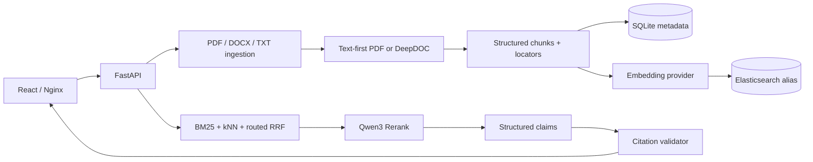

# EMC_RAG · EMC Evidence Assistant

面向电磁兼容（EMC）试验知识的可复现、证据优先 RAG 展示项目。EMC_RAG 将多格式文档解析、混合检索、重排、结构化引用校验与拒答闭环放在一个可公开审查的 Demo 中。

An evidence-first, reproducible RAG demo for electromagnetic-compatibility (EMC) knowledge. EMC_RAG combines multi-format ingestion, hybrid retrieval, reranking, citation validation, and fail-closed answering in a public-reviewable application.

> **Public evidence status / 公开证据状态：`VERIFIED_SYNTHETIC / PASSED`**<br>
> 当前提交包含可复现的公开合成评测报告。它只证明 committed fixtures 上的当次结果，不证明真实标准覆盖、实验室认可、历史职责、用户试用或生产效果。

[](https://github.com/aristotlephil8-cell/emc-rag-evidence-assistant/actions/workflows/ci.yml)

[中文](#中文) · [English](#english) · [面试审阅指南](docs/PORTFOLIO.md) · [Architecture](docs/ARCHITECTURE.md) · [Evaluation](docs/EVALUATION.md) · [Badcases](docs/BADCASES.md) · [Security](docs/SECURITY.md)

## 中文

### 项目定位

EMC_RAG 是简历项目中可公开展示的工程与验证部分，不是生产系统、实验室认可工具或真实标准数据库。冻结评测资料是虚构的合成 EMC 教学资料；另有一组独立的公开真实参考 PDF（见 `datasets/public_real/`），并附来源、许可边界与哈希。仓库不包含个人简历、客户资料、内部试验记录、付费标准全文、凭据或本地参考项目痕迹。

### 个人贡献与公开边界

我在 EMC_RAG 项目中担任核心开发。本仓库展示以下可公开的职责、工程实现与验证证据：

| 个人贡献 | 公开可审查入口 |
| --- | --- |
| 文档解析入库：OCR、结构感知切分、元数据管理、幂等写入与索引版本管理 | [`backend/app/ingestion/`](backend/app/ingestion/)、[`backend/app/services.py`](backend/app/services.py) |
| 混合检索与精排：BM25、向量检索、RRF、精确/语义查询分流与 Reranker | [`backend/app/search.py`](backend/app/search.py) |
| 引用校验与拒答：来源/页码/条款定位、证据不足拒答和人工复核入口 | [`backend/app/providers.py`](backend/app/providers.py)、[`backend/app/services.py`](backend/app/services.py) |
| 分层评测与回归：解析、检索、精排、生成和引用链路的冻结评测与回归测试 | [`evaluation/`](evaluation/)、[`backend/tests/`](backend/tests/) |

公开边界：仓库仅保留可公开的合成资料、代码、测试、来源说明和脱敏报告；历史项目的内部文档、原始评测集与试用日志不发布。因此，仓库内的公开合成结果与简历中的历史结果分别陈述、互不替代。

### 90 秒审阅路径

如果你是招聘方或面试官，建议按下面顺序阅读：

1. 先看截图和下方五项能力，确认项目解决的问题与产品形态。
2. 再看公开合成评测卡片，区分“仓库当次可复现实验”和“EMC_RAG 项目历史结果”。
3. 最后沿着 [面试审阅指南](docs/PORTFOLIO.md) 进入入口代码、架构、[Badcase](docs/BADCASES.md) 和评测协议。

| 本仓库公开合成评测（`VERIFIED_SYNTHETIC`） | 当次结果 |
| --- | ---: |
| Parser 成功率（16 / 16 逻辑文档） | 100% |
| Routed Hybrid RRF + Rerank：Evidence Recall@5 / MRR@10 / nDCG@5 | 100% / 1.000 / 1.000 |
| Citation Precision / Recall / 服务端 Citation ID 有效性 | 94.4% / 100% / 100% |
| 拒答准确率 | 93.8% |
| P95 检索 / 生成延迟 | 261 ms / 2.65 s |

指标来自 [`artifacts/evaluation/latest.json`](artifacts/evaluation/latest.json) 的一次固定配置、固定公开合成语料运行。请勿将其外推到真实 EMC 标准、私有资料或生产流量。

<details>
<summary>EMC_RAG 项目历史结果（不属于本仓库的可复现评测）</summary>

以下是简历中 `2023.05–2024.05` EMC_RAG 项目的历史结果，保留在此只用于帮助面试官理解履历与公开展示部分的关系；原始文档、评测集和运行日志未随仓库发布，因此**不能**作为本仓库效果证据。

| 简历陈述范围 | 简历报告指标 |
| --- | --- |
| 160 份分层抽样文档 | 解析验收通过率 82.5% → 95.6% |
| 120 个固定问题、164 条必需证据 | Evidence Recall@5 68.3% → 84.1%；MRR 0.56 → 0.74 |
| 80 个固定问题、前后各 250 组原子主张-引用关系 | 引用准确率 92.4%；无证据主张占比 16.8% → 5.6% |
| 12 人连续 4 周、3,200 次请求 | P95 TTFT 1.85 s；端到端成功率 99.2% |

公开仓库展示的是 EMC_RAG 项目可公开的“证据优先 RAG”工程实现与独立公开合成评测，不是完整历史系统的源代码归档，也不替代历史结果的原始证据。

</details>


上图来自本机 fake Provider 的实际工作区：展示文档状态、上传边界和问答界面；不展示、也不证明在线模型效果或评测指标。

核心能力：

- PDF、DOCX、UTF-8 TXT 入库；上传上限 20 MiB，PDF 上限 50 页。
- 文本 PDF 优先直接提取；扫描件、表格或复杂版面整份回退到 DeepDOC OCR、版面与表格结构路径。
- SHA-256 文档身份、稳定 `chunk_id`、结构感知切块、SQLite 版本/状态记录和幂等重入。
- Elasticsearch 8.11.3 的 BM25 Top 50 与 1024 维 kNN Top 50，经加权 RRF（`k=60`）融合。
- 标准号、条款号、型号、数值单位型查询使用 `0.7 lexical / 0.3 vector`；一般语义查询使用 `0.3 / 0.7`。
- 候选 Top 30 进入 Qwen3 Rerank，最终返回 Top 5；重排失败会显式降级，问答链路 fail closed。
- 生成模型先返回 `claims + citation_ids`；服务端逐条校验引用。证据不足返回 `insufficient_evidence`，引用、结构或检索异常返回 `needs_review`。
- React 展示文档状态、检索分数轨迹、来源定位、评测方案与 [Badcase](docs/BADCASES.md)。

详细数据流、索引生命周期和故障边界见 [架构说明](docs/ARCHITECTURE.md)。

### 架构概览



### 快速启动

前置条件：Docker Desktop / Docker Engine、Docker Compose v2。首次启动会下载并校验固定版本的 DeepDOC 模型资产；模型体积不计入 Git 仓库。

默认使用 fake Provider：

```powershell
.\scripts\start.ps1 -Provider fake
```

打开：

- 前端：<http://localhost:5173>
- 后端与 OpenAPI：<http://localhost:8000/docs>
- 健康检查：<http://localhost:8000/health>

fake Provider 的向量、重排和答案是确定性占位行为，只适合走通入库、API、SSE 和 UI，不得据此发布效果指标。可从 `datasets/generated/documents/` 上传公开合成样例。

停止服务但保留命名卷：

```powershell
.\scripts\stop.ps1
```

### 使用 DashScope

真实 Provider 模式固定使用 `text-embedding-v4`（1024 维）、`qwen3-rerank` 和 `qwen3.7-plus-2026-05-26`。密钥只应注入当前进程或可信密钥管理工具，禁止写入仓库：

```powershell
$env:DASHSCOPE_API_KEY = "<set-locally-never-commit>"
.\scripts\evaluate.ps1
.\scripts\start.ps1 -Provider dashscope
```

DashScope 展示模式会读取已通过评测报告中的 `runtime_config + config_hash`，并校验模型、Parser/Chunker/索引版本、检索参数和 dev 锁定拒答阈值；报告缺失、门禁失败或配置漂移时拒绝启动。

> **数据外发警示：** DashScope 模式会把上传文档的切块文本发送给远端 Embedding 服务，把查询及候选文本发送给 Rerank 服务，并把查询及 Top 5 证据发送给生成服务。只有在你有权处理并外发这些内容时才可启用。fake 模式不产生此类模型 API 外发。

更多凭据、端口、文件与错误信息边界见 [安全说明](docs/SECURITY.md)。

### API

| Method | Path | Contract |
| --- | --- | --- |
| `POST` | `/api/v1/documents/ingest` | `multipart/form-data`，字段名 `file`；支持 PDF/DOCX/TXT |
| `GET` | `/api/v1/documents` | 文档哈希、解析/切块/索引版本、状态与块数量 |
| `POST` | `/api/v1/retrieval/search` | `{"query":"...","top_k":5,"variant":"routed_hybrid_rrf_rerank"}` |
| `POST` | `/api/v1/chat/stream` | `{"query":"..."}`；SSE 事件仅为 `sources`、`token`、`done`、`error` |
| `GET` | `/api/v1/evaluation/latest` | 返回已提交的评测报告；没有有效报告时才返回 `status=not_run`、`evidence_status=NOT_VERIFIED` |

来源定位统一包含：`document_id / filename / page_number / section_path / bbox / table_row / chunk_id`。检索接口可切换五种方案：`bm25`、`vector`、`hybrid_rrf`、`hybrid_rrf_rerank`、`routed_hybrid_rrf_rerank`。

### 合成数据与评测

冻结数据集标记为 `VERIFIED_SYNTHETIC`：

- 16 份逻辑文档：12 primary、4 distractor。
- 6 PDF（2 扫描、2 表格、2 文本）、5 DOCX、5 TXT。
- 40 个固定问题：32 answerable、8 unanswerable；24 dev、16 frozen test。
- 40 条 required evidence；Gold 只认稳定的文档与 locator 身份，不用关键词相似度代替。

校验数据契约：

```powershell
conda create -n emc_rag python=3.11 -y
conda run --no-capture-output -n emc_rag python -m pip install -e "backend[dev]"
.\scripts\evaluate.ps1 -ValidateOnly
```

在 Elasticsearch 已运行、DeepDOC 资产可下载且当前进程已注入 `DASHSCOPE_API_KEY` 后，才可运行在线合成评测：

```powershell
.\scripts\evaluate.ps1
```

评测比较五组方案，并输出 Parser 成功率、Hit@5、Evidence Recall@5、MRR@10、nDCG@5、Context Precision@5、引用 ID 有效率、Citation Precision/Recall、拒答准确率、无答案误答率、可回答问题误拒率与 P50/P95 延迟。拒答阈值只在 dev 网格选择，配置锁定后再看 frozen test。

效果门禁为：最终方案 Recall@5 不低于 BM25、nDCG@5 高于 BM25、无答案误答率不劣于 BM25、服务端引用 ID 有效率为 100%。详细定义见 [评测协议](docs/EVALUATION.md)。

### 当前证据状态

| 项目 | 当前状态 | 可陈述边界 |
| --- | --- | --- |
| 代码与公开合成 fixtures | `IMPLEMENTED` | 可审查架构、契约和冻结哈希 |
| fake Provider | `IMPLEMENTED_FAKE_VERIFIED` | 仅接口/流程占位；不是语义检索或生成质量证据 |
| 数据集规模与 split | `VERIFIED_SYNTHETIC_CONTRACT` | 仅说明 committed fixtures 的组成 |
| `artifacts/evaluation/latest.json` | `VERIFIED_SYNTHETIC / PASSED` | 固定公开合成 fixtures 的 16 文档 / 40 问题当次结果；详见报告 |
| DashScope 真实在线评测 | `VERIFIED_SYNTHETIC / PASSED` | 只证明当前公开合成协议与固定配置，不代表真实资料或生产效果 |
| DeepDOC 真实资产与扫描/表格烟测 | `VERIFIED_LOCAL` | 固定五项资产校验、公开合成扫描 PDF 与表格 PDF 均通过；不是生产隔离证据 |
| fake Provider Docker Compose | `VERIFIED_LOCAL` | 一键启动后 Elasticsearch、后端和前端健康；仅流程/接口验证 |
| GitHub Actions | `VERIFIED_REMOTE` | `main` 的最近一次 CI 通过；以 Actions 页面为准 |
| UI 截图 | `PUBLISHED_FAKE_DEMO_SCREENSHOT` | 本机 fake Provider 流程展示；不包含效果指标 |

即使未来报告标记为 `VERIFIED_SYNTHETIC`，它也只证明公开合成 fixtures 上的当次结果，不证明真实标准覆盖、实验室认可、生产效果、历史职责、用户试用或生产请求量。

### 第三方与许可

项目代码以 Apache-2.0 发布。DeepDOC/RAGFlow 适配与五个模型资产的来源、固定 revision、SHA-256 校验和修改说明见 [THIRD_PARTY_NOTICES.md](THIRD_PARTY_NOTICES.md)。模型二进制由使用者下载并校验，不进入 Git。

## English

### Scope

EMC_RAG is the publicly shareable engineering and validation portion of the resume project. It is not a production service, accredited laboratory tool, or repository of real standards. It contains only fictional synthetic EMC teaching fixtures—no resume, customer material, internal test record, credential, full standard text, or local reference-project trace.

The implemented flow supports PDF/DOCX/UTF-8 TXT ingestion; text-first PDF parsing with whole-document DeepDOC fallback for scans, tables, and complex layouts; SHA-256 document identity; stable source locators; SQLite lifecycle metadata; Elasticsearch BM25 and 1024-dimensional kNN retrieval; weighted RRF; Qwen3 reranking; structured claims; server-side citation validation; and fail-closed refusal/review states. Frozen evaluation fixtures are synthetic; separately curated public-real references live in `datasets/public_real/` with provenance and rights boundaries.

Exact-like queries use `0.7 lexical / 0.3 vector`; semantic queries use `0.3 / 0.7`. BM25 Top 50 and kNN Top 50 are fused with RRF `k=60`; Top 30 are offered to the reranker and Top 5 become evidence. See [Architecture](docs/ARCHITECTURE.md).

### Quickstart

Prerequisites: Docker Engine/Desktop and Docker Compose v2. The first start downloads and verifies pinned DeepDOC assets; model binaries are excluded from Git.

```powershell
.\scripts\start.ps1 -Provider fake
```

Open <http://localhost:5173> for the UI and <http://localhost:8000/docs> for OpenAPI. Upload only material you are authorized to process; the committed examples are under `datasets/generated/documents/`.

```powershell
.\scripts\stop.ps1
```

The fake provider is deterministic contract scaffolding, not semantic retrieval, reranking, or answer-quality evidence.

For DashScope mode, inject `DASHSCOPE_API_KEY` into the current process—never commit it—run `evaluate.ps1`, and only then run `start.ps1 -Provider dashscope`. Startup validates the passed report's runtime configuration hash and locked dev threshold; a missing, failed, or drifted report is rejected. This mode sends document chunks, queries, candidates, and selected evidence to remote model APIs. Review [Security](docs/SECURITY.md) before enabling it.

### Frozen synthetic evaluation

The `VERIFIED_SYNTHETIC` corpus contains 16 logical documents (12 primary and 4 distractors): 6 PDFs, 5 DOCX files, and 5 TXT files. The 40 cases comprise 32 answerable and 8 unanswerable questions, split into 24 development and 16 frozen-test cases with 40 exact required-evidence identities.

Validate the contract without producing online metrics:

```powershell
.\scripts\evaluate.ps1 -ValidateOnly
```

The five variants are BM25, Vector, Hybrid RRF, Hybrid RRF + Rerank, and Routed Hybrid RRF + Rerank. Metric definitions, threshold discipline, gates, and Badcase categories are documented in [Evaluation](docs/EVALUATION.md).

### Reviewer path and evidence boundary

Start with the workspace screenshot, then the [reviewer guide](docs/PORTFOLIO.md), the [architecture](docs/ARCHITECTURE.md), and the committed [`latest.json`](artifacts/evaluation/latest.json). The current public result is **`VERIFIED_SYNTHETIC / PASSED`** on the committed synthetic fixtures: Parser success is 100%; the routed final variant has Evidence Recall@5 / MRR@10 / nDCG@5 of 100% / 1.000 / 1.000; and server-side citation-ID validity is 100%.

These numbers do not establish real-standard coverage, accreditation, production performance, historical responsibility, user trials, or production traffic. Historical EMC_RAG project results are deliberately separated in the Chinese reviewer section and are not reproduced by this repository.

### License

EMC_RAG is licensed under Apache-2.0. DeepDOC/RAGFlow provenance, pinned model revision, asset verification, and modifications are documented in [THIRD_PARTY_NOTICES.md](THIRD_PARTY_NOTICES.md). Model binaries are downloaded by the operator and intentionally excluded from Git.
