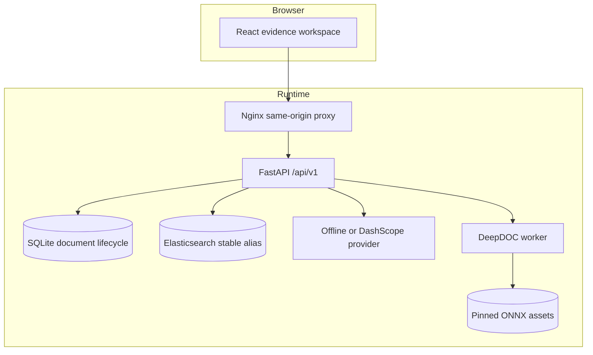
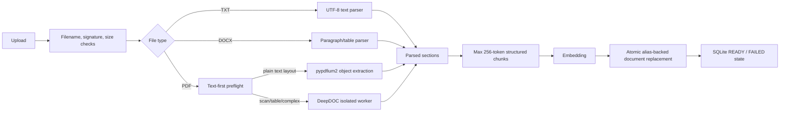
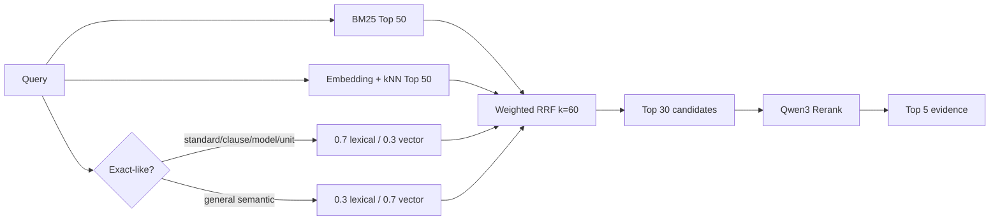

# EMC_RAG Architecture / 架构说明

## System boundary / 系统边界

EMC_RAG is a single-user public demo composed of a React/Vite frontend, FastAPI backend, Elasticsearch 8.11.3, and SQLite. It intentionally omits authentication, multi-tenancy, PostgreSQL, Redis, and an asynchronous queue.

EMC_RAG 是由 React/Vite 前端、FastAPI 后端、Elasticsearch 8.11.3 和 SQLite 组成的单用户公开 Demo。它有意不加入认证、多租户、PostgreSQL、Redis 或异步队列。



Docker host ports bind to `127.0.0.1` by default. Named volumes preserve SQLite runtime state, Elasticsearch data, and downloaded DeepDOC models.

## Ingestion flow / 入库流程



### Identity and idempotency / 身份与幂等

- `document_id = doc_` plus the first 24 hexadecimal characters of the file SHA-256.
- `chunk_id` is deterministically derived from document identity, section/window position, and chunk-text SHA-256.
- SQLite stores the file hash, parser version, chunker version, index version, status, and chunk count.
- A repeated upload is returned as idempotent only when versions match and Elasticsearch still contains the expected number of chunks. Missing index data triggers re-indexing.
- Elasticsearch uses a stable alias over versioned physical indexes. Document replacement builds the next index and switches the alias, avoiding a delete-then-insert visibility gap.

### Parsing policy / 解析策略

- Accepted formats: PDF, DOCX, UTF-8 TXT.
- Upload limit: 20 MiB. PDF limit: 50 pages.
- Text PDFs are extracted first with page/object locators in `pdf_points_top_left` coordinate space.
- Image-only, table, or complex-layout PDFs are routed as a whole document to the DeepDOC path.
- DeepDOC performs OCR detection/recognition, layout detection, and table-structure processing. Its worker deadline is 120 seconds. Linux/POSIX applies a 2 GiB address-space cap; the container also has a 2 GiB memory limit. Windows relies on the worker boundary, timeout, and deployment/container limit because Python exposes no equivalent `RLIMIT_AS` there.
- Parsed-document caps are 1,000,000 characters, 5,000 sections, and 5,000 chunks.

Every source locator uses the same public shape:

```json
{
  "document_id": "doc_...",
  "filename": "synthetic_priority_table.pdf",
  "page_number": 1,
  "section_path": ["..."],
  "bbox": [42.0, 72.0, 558.0, 131.0],
  "table_row": 1,
  "chunk_id": "..."
}
```

Fields may be `null` when the source format does not define them. Parser-specific details remain under `parser_locator` in the API model.

## Retrieval flow / 检索流程



The non-routed hybrid variants use equal RRF weights. Sorting uses stable chunk IDs as a final tie-breaker. The response exposes BM25, vector, RRF, and rerank score traces where applicable.

If reranking fails, retrieval records a degradation code. The standalone retrieval endpoint can expose degraded results, but the chat service fails closed and returns `needs_review` rather than generating an answer from an unreviewed degraded path.

## Answer and citation contract / 答案与引用契约

The generator does not directly stream free-form text. It first returns a structured object:

```json
{
  "answerable": true,
  "claims": [
    {"text": "...", "citation_ids": ["S1"]}
  ],
  "missing_information": null
}
```

The server checks that every factual claim has at least one citation and that every citation ID belongs to the offered Top 5 sources. Only validated content is converted to SSE. The public SSE event names are limited to `sources`, `token`, `done`, and `error`.

Terminal states:

| State | Meaning |
| --- | --- |
| `answered` | Evidence score passed the threshold and structured citations validated. |
| `insufficient_evidence` | No evidence or the top score is below the locked refusal threshold; no factual answer is asserted. |
| `needs_review` | Retrieval degraded, provider failed, or answer/citation structure failed validation. |

## Provider boundary / Provider 边界

| Provider | Purpose | Evidence label |
| --- | --- | --- |
| `offline` | Deterministic API, UI, unit-test and CI scaffolding | `IMPLEMENTED_OFFLINE_VERIFIED`; never effectiveness evidence |
| `dashscope` | `text-embedding-v4`, `qwen3-rerank`, `qwen3.7-plus-2026-05-26` | `VERIFIED_SYNTHETIC` only for the committed public evaluation report; not real-standard, private-corpus, or production evidence |

DashScope mode is an outbound-data boundary. See [SECURITY.md](SECURITY.md).

## Rebuildability / 可重建性

SQLite is the lifecycle record; Elasticsearch is a rebuildable index. The pipeline index signature includes mapping/model revision, chunker, embedding model, and dimension inputs. Changes to those inputs invalidate idempotent reuse and require rebuilding indexed chunks.
