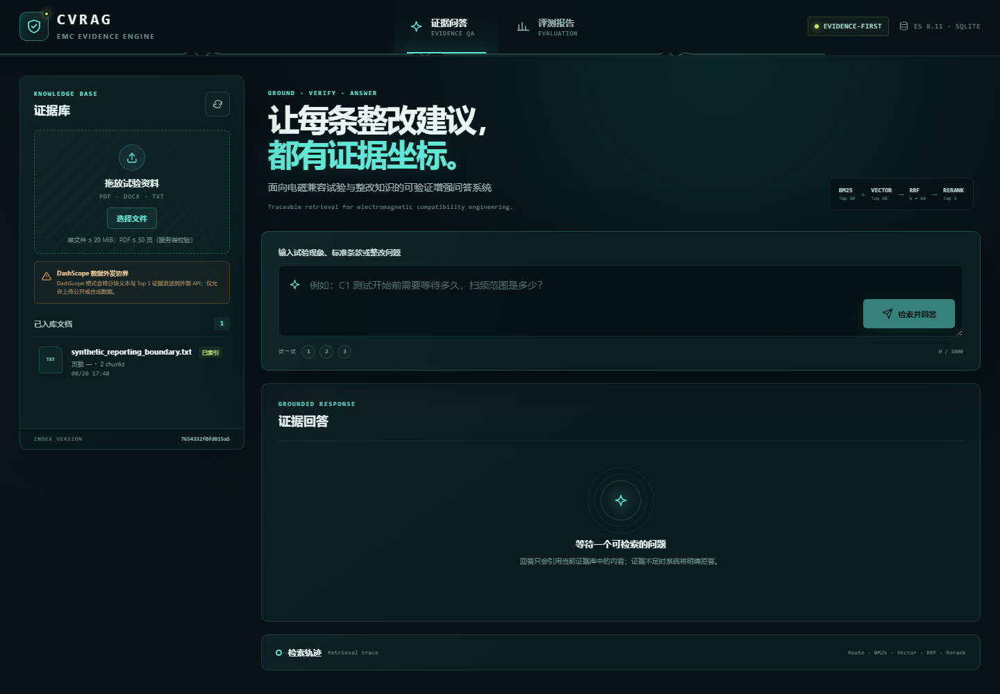

# emcRAG GitHub 展示草稿 v1

> 用途：供项目负责人审查的 GitHub 展示方案与 README 改写底稿。
>
> 本文件不替代当前 `README.md`，也不代表已经发布到 GitHub。所有历史项目结果与当前公开仓库结果分开陈述。

## 一、仓库定位

仓库名称建议统一为：

> **emcRAG · EMC Evidence Assistant**

一句话定位：

> 面向电磁兼容试验知识的证据优先 RAG 展示项目，公开实现文档解析、混合检索、Rerank、引用校验和证据不足拒答；当前评测基于公开合成语料，不代表真实标准覆盖或生产效果。

面试官查看仓库的唯一目的，是判断项目经历是否真实，以及候选人是否真正参与并理解其中的关键工作。仓库需要让对方能够从代码和证据中核对：

1. 项目背景和需求是否具体，而不是事后拼接的技术名词；
2. 本人负责的模块、设计和实现是否有明确边界；
3. 遇到的 Badcase 是否能从现象追到根因，再追到代码和测试；
4. 候选方案、最终取舍和代价是否能讲清楚；
5. 评测结果是否有数据、指标定义和运行条件支撑；
6. README 中的叙述是否能被代码、测试、报告和提交历史交叉验证。

仓库不需要承担的角色：

- 不作为 2023.05—2024.05 历史系统的完整源码归档；
- 不发布内部 EMC 文档、真实标准全文、原始试用日志或私有评测集；
- 不把当前合成评测结果写成真实 EMC 资料效果；
- 不把历史试用指标写成当前仓库运行结果；
- 不把系统描述为生产部署、实验室认可工具或自动整改系统。

## 二、建议替换的 README 首屏

```markdown
# emcRAG · EMC Evidence Assistant

面向电磁兼容（EMC）试验知识的证据优先 RAG 项目。
仓库公开项目背景、关键设计、代码实现、Badcase、方案取舍和评测证据，
用于核对项目经历中的个人参与边界与技术理解。

> 公开证据状态：`VERIFIED_SYNTHETIC / PASSED`
>
> 当前结果来自仓库内冻结的公开合成语料，只证明当前协议与配置下的可复现实验，
> 不代表真实 EMC 标准覆盖、历史项目结果、用户试用或生产效果。

## 项目背景

在 EMC 试验与整改过程中，标准、试验规程、设备手册和历史整改案例通常格式复杂、版本分散。
工程人员既需要精确查询标准编号和条款，也需要根据故障现象检索相似案例；
而扫描件、表格、条款层级和来源定位又会影响后续检索与结论复核。

因此，项目重点不是简单增加一个聊天入口，而是把专业资料转化为可检索、可引用、可评测的领域知识。

## 项目目标

项目围绕传导发射（CE）与辐射发射（RE）场景，逐步解决四个问题：

1. 复杂资料如何解析并保留章节、条款、页码和表格关系；
2. 如何同时覆盖标准编号等精确查询与故障现象等语义查询；
3. 如何让回答中的关键结论能够回到具体证据；
4. 如何用固定评测和 Badcase 回归判断方案是否真的有效。

系统输出候选分析、证据依据和复验建议，最终判断仍由 EMC 工程师完成。

## 设计主线

```text
业务问题
→ 需求收敛
→ 基础 RAG 原型
→ 复杂文档入库优化
→ 混合检索与 Rerank
→ 证据约束回答
→ 评测、Badcase 回归与效果验证
```

系统只提供候选信息、引用依据和复验建议；证据不足、证据冲突或高风险场景进入拒答/复核状态，
最终判断仍由 EMC 工程师完成。

## 我的贡献

| 方向 | 可审查入口 | 当前公开边界 |
|---|---|---|
| 文档解析与知识入库 | `backend/app/ingestion/`、`backend/app/chunking.py` | 公开合成 PDF、DOCX、TXT |
| 混合检索与精排 | `backend/app/search.py` | 当前公开合成评测，不外推真实资料效果 |
| 来源定位与引用校验 | `backend/app/providers.py`、`backend/app/services.py` | 校验引用身份，不等于证明语义支持度 |
| 评测与 Badcase 回归 | `evaluation/`、`backend/tests/`、`docs/BADCASES.md` | 历史数据集与试用日志不发布 |

## 公开评测摘要

| 指标 | 当前结果 | 条件 |
|---|---:|---|
| Parser 成功率 | 100% | 16 份公开合成逻辑文档 |
| Evidence Recall@5 / MRR@10 / nDCG@5 | 100% / 1.000 / 1.000 | Routed Hybrid RRF + Rerank |
| Citation Precision / Recall | 94.4% / 100% | 固定公开合成评测 |
| 服务端 Citation ID 有效性 | 100% | 结构化引用校验 |
| 拒答准确率 | 93.8% | 固定公开合成评测 |
| P95 检索 / 生成延迟 | 261 ms / 2.65 s | 当前报告记录的运行条件 |

完整定义、配置哈希、语料哈希和评测边界见 [`artifacts/evaluation/latest.json`](../artifacts/evaluation/latest.json)。

## 项目真实性核对路径

1. 从项目背景和需求开始，确认问题是否来自真实业务；
2. 查看个人贡献表，确认本人负责什么、不负责什么；
3. 沿着架构和代码入口核对核心链路；
4. 查看 Badcase，确认问题定位和修复过程是否具体；
5. 对比候选方案和取舍，判断是否真正理解设计原因；
6. 最后查看评测结果，核对指标、数据、条件和代码是否一致。

详细入口：

- [`docs/PORTFOLIO.md`](PORTFOLIO.md)：项目故事、个人贡献范围和代码入口；
- [`docs/ARCHITECTURE.md`](ARCHITECTURE.md)：架构、数据流和关键状态；
- [`docs/BADCASES.md`](BADCASES.md)：失败现象、根因、修复和验证；
- [`docs/EVALUATION.md`](EVALUATION.md)：数据集、指标、对比方案和效果门禁。



## 快速启动

```powershell
.\scripts\start.ps1 -Provider fake
```

打开 `http://localhost:5173`，上传 `datasets/generated/documents/` 中的公开合成样例。

`fake` Provider 只用于验证接口、入库、SSE 和 UI 流程，不用于证明语义检索或生成质量。
如需使用真实 Provider，先阅读 [`docs/SECURITY.md`](SECURITY.md)，并确认上传资料具有外发授权。

## 项目结果

当前公开评测使用仓库内固定的合成 EMC 资料和问题集，用于验证解析、检索、排序、引用和拒答链路。
评测报告中同时记录数据规模、指标定义、对比方案、配置哈希和效果门禁，确保结果能够复现和比较。

历史项目中的真实资料、评测标注和试用记录不直接放入仓库；仓库展示的是可公开的工程实现和评测过程。

## 历史项目结果与公开实现

简历中的历史项目结果仅用于说明 2023.05—2024.05 项目的研发经历，
不作为当前仓库的可复现实验结果。历史结果包括文档解析、检索、引用和试用等指标，
其原始资料、标注集和运行日志不随仓库发布。

当前仓库提供公开资料下的工程实现、方案对比和评测证据；历史项目提供真实业务背景和研发经历。
两者各自承担不同的证明作用。

## 许可证与第三方说明

第三方解析组件、模型资产、数据和示例的来源与许可边界见 [`THIRD_PARTY_NOTICES.md`](../THIRD_PARTY_NOTICES.md)。
```

## 三、建议保留的文档结构

```text
README.md                         首页与快速入口
docs/PORTFOLIO.md                 项目说明、个人贡献边界、代码地图
docs/ARCHITECTURE.md              当前代码对应的架构和数据流
docs/EVALUATION.md                数据集、指标、门禁和复现方法
docs/BADCASES.md                  失败路径、根因、修复和剩余边界
docs/SECURITY.md                  凭据、数据外发和部署限制
artifacts/evaluation/latest.json  当前公开评测报告
evaluation/                       数据契约、指标实现和评测测试
```

不建议在公开仓库中新增以下内容：

- 项目故事全文；
- 个人简历或联系方式；
- 内部项目单位、合作方和真实设备信息；
- 未脱敏历史报告；
- 未经确认的历史指标原始表；
- `private_*` 评测脚本、私有运行结果或本地环境文件。

## 四、个人贡献与证据映射

| 个人经历表达 | 仓库中的核对入口 | 面试核对重点 |
|---|---|---|
| 参与复杂文档解析与结构化入库 | 解析器、切分器、locator、生命周期代码和对应测试 | 能否解释数据结构、失败路径和幂等原因 |
| 参与 BM25/向量/RRF/Rerank 优化 | 检索代码、五种变体、评测协议和 Badcase | 能否解释候选方案、排序机制和代价 |
| 参与证据约束回答设计 | claims、citation IDs、拒答和 review 状态 | 能否区分引用身份校验与语义支持 |
| 参与分层评测与 Badcase 回归 | 固定数据、指标实现、门禁和回归测试 | 能否解释指标定义、基线和结果条件 |
| 历史试用与业务指标 | 仅作为历史项目经历单独说明 | 能否说明数据来源、范围和本人参与方式 |

## 五、面试真实性的最小证据链

每个简历要点都应能沿着下面的链路被核对：

```text
简历表述
→ 项目背景中的具体问题
→ 个人贡献边界
→ 架构中的模块位置
→ 代码入口
→ Badcase 或设计取舍
→ 测试/评测结果
→ 剩余边界
```

如果某项只有故事描述，没有代码、测试、日志或评测证据，就不能在 README 中写成已经完成的个人成果。

## 六、审查重点

本版请重点审查以下内容：

1. “公开展示版”这个仓库定位是否符合你的真实项目经历；
2. 首屏是否准确体现你想投递的 RAG/大模型应用方向；
3. “个人贡献”表格中的四个方向是否需要缩小或改写；
4. 当前公开合成指标是否适合放在 README 首屏；
5. 历史项目结果是否需要在公开仓库中保留，还是只放在面试资料中；
6. 是否允许下一步把这份草稿整理成正式 `README.md`。
